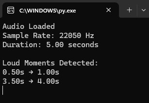
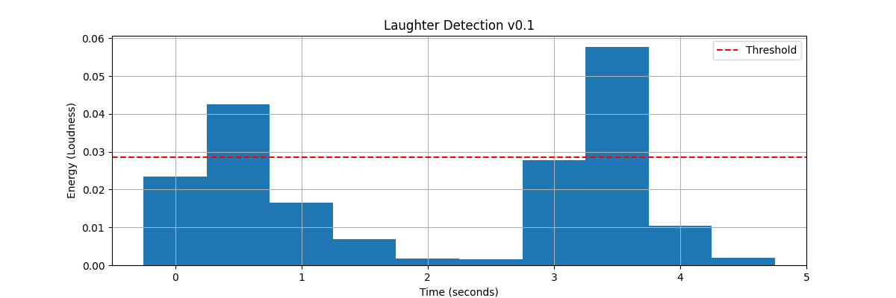
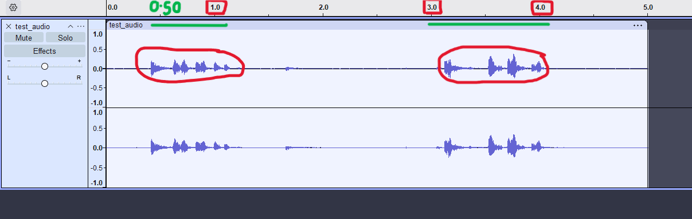

# MoodCutter

**MoodCutter** is an open-source Python project that automatically detects and extracts **funny** and **sad** moments from videos. The goal is to make emotional video clipping effortless and accessible for content creators, researchers, or anyone who wants to analyze video emotions.

---

## Version 0.1 - Laughter Detection MVP

The first version focuses on **audio-based laughter detection** using energy analysis. It processes audio files, identifies loud moments (potential laughter), and visualizes the results.

### What's Working in v0.1:
- ✅ Audio loudness analysis using RMS energy
- ✅ Dynamic threshold-based detection
- ✅ Time-stamped loud moment extraction
- ✅ Energy visualization graph
- ✅ Command-line interface

---

## Screenshots

### Terminal Output


#### *Audio analysis results showing detected loud moments with timestamps*

### Energy Visualization


#### *Bar chart showing audio energy levels over time with detection threshold*

### Waveform Analysis


#### *Audio waveform with highlighted loud segments (potential laughter)*

---

## Features (v0.1)

- Detect loud moments in audio (potential laughter)
- Configurable chunk duration and sensitivity threshold
- Visual energy analysis with matplotlib
- Export timestamps of detected moments
- Modular architecture for future expansion

---

## Installation

1. Clone the repository:
```bash
git clone https://github.com/axtheon/MoodCutter.git
cd MoodCutter
```

2. Install dependencies:
```bash
pip install -r requirements.txt
```

---

## Usage

Run the main script with default settings:
```bash
python src/main.py
```

The script will:
1. Load the test audio file (`examples/audio/test_audio.wav`)
2. Analyze audio in 0.5-second chunks
3. Detect moments exceeding 1.5x average energy
4. Display timestamps in the terminal
5. Show an interactive energy visualization graph

### Configuration

You can adjust detection parameters in `src/main.py`:
```python
CHUNK_DURATION = 0.5          # Analysis window size (seconds)
THRESHOLD_MULTIPLIER = 1.5    # Sensitivity (lower = more sensitive)
```

---

## How It Works

1. **Audio Loading**: Loads audio file using `librosa`
2. **Chunking**: Divides audio into fixed-duration segments
3. **Energy Calculation**: Computes RMS energy (loudness) for each chunk
4. **Threshold Detection**: Identifies chunks exceeding the dynamic threshold
5. **Visualization**: Displays energy levels and detected moments

---

## License

This project is open-source and available under the [MIT License](LICENSE).

---

## Roadmap

### v0.2 (Upcoming)
- [ ] Video processing integration
- [ ] Extract video segments based on audio timestamps
- [ ] Support for multiple audio formats

### Future Versions
- [ ] Machine learning-based laughter classification
- [ ] Sad moment detection (audio + visual cues)
- [ ] GUI interface
- [ ] Batch processing support
- [ ] Export to multiple formats
- [ ] Real-time detection

---

## Contributing

Contributions are welcome! Feel free to:
- Report bugs
- Suggest features
- Submit pull requests

---

**Made with ❤️ for content creators and video enthusiasts**
